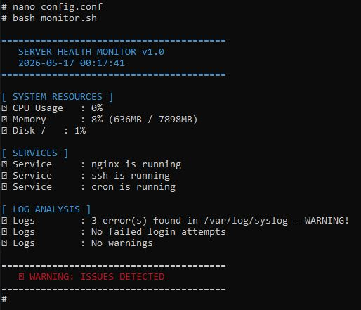
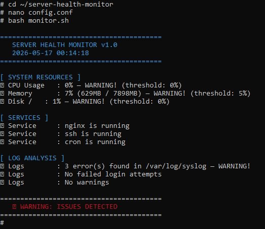

# 🖥️ Server Health Monitor

> Automated Linux server health monitoring tool built with Bash — simulating real production monitoring routines used in enterprise environments.


---

## 📸 Demo Output

### ✅ All Systems Healthy


### ⚠️ Warning Detected


---

## ✨ Features

| Feature | Description |
|---------|-------------|
| 🔥 CPU Monitor | Alerts when usage exceeds defined threshold |
| 💾 Memory Monitor | Displays usage in MB and percentage |
| 💿 Disk Monitor | Checks all mounted partitions |
| ⚙️ Service Monitor | Verifies nginx, ssh and cron are running |
| 📋 Log Analyser | Detects errors, warnings and failed logins |
| 🎨 Colour Output | Color-coded terminal output for quick scanning |
| 📝 Audit Log | Automatically logs every run to monitor.log |
| ⚡ Configurable | All thresholds configurable via config.conf |

---

## 📁 Project Structure

```
server-health-monitor/
├── scripts/
│   ├── check_cpu.sh          # CPU usage monitoring
│   ├── check_memory.sh       # Memory usage monitoring
│   ├── check_disk.sh         # Disk space monitoring
│   ├── check_services.sh     # Service status checking
│   └── check_logs.sh         # Log analysis & parsing
├── monitor.sh                # Main orchestration script
├── config.conf               # Threshold configuration
└── README.md
```

---

## ⚙️ Configuration

Edit `config.conf` to set thresholds based on your environment:

```bash
CPU_THRESHOLD=80      # Alert if CPU > 80%
MEMORY_THRESHOLD=85   # Alert if Memory > 85%
DISK_THRESHOLD=90     # Alert if Disk > 90%
SERVICES="nginx ssh cron"
LOG_FILE="/var/log/syslog"
```

---

## 🚀 Quick Start

```bash
# Clone the repository
git clone https://github.com/kaelcloud/server-health-monitor.git
cd server-health-monitor

# Run full health check
bash monitor.sh

# Run individual checks
bash scripts/check_cpu.sh
bash scripts/check_memory.sh
bash scripts/check_disk.sh
bash scripts/check_services.sh
bash scripts/check_logs.sh
```

---

## 🔄 Automate with Cron

Set the monitor to run automatically every 5 minutes:

```bash
# Open crontab
crontab -e

# Add this line
*/5 * * * * /bin/bash ~/server-health-monitor/monitor.sh
```

---

## 💡 Background

This project was built to simulate production server monitoring practices from real enterprise Linux environments — covering the same checks used in hospital IT infrastructure monitoring, including CPU, memory, disk space, service availability, and log analysis.

---

## 🛠️ Tech Stack

- **Shell:** Bash
- **OS:** Linux (Ubuntu/WSL2)
- **Tools:** `top`, `free`, `df`, `service`, `grep`, `awk`, `tail`
- **Version Control:** Git + GitHub

---

## 📈 Future Improvements

- [ ] Email / Telegram alert integration
- [ ] Web dashboard with realtime stats
- [ ] Docker container monitoring
- [ ] Prometheus metrics export
